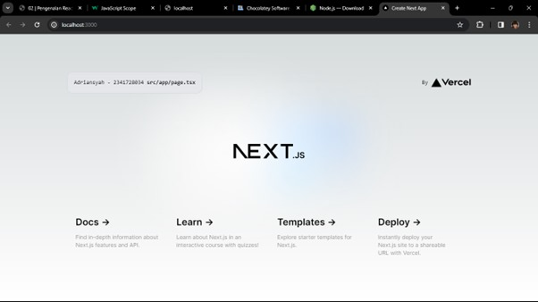
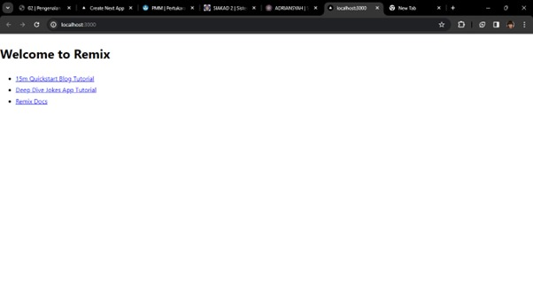
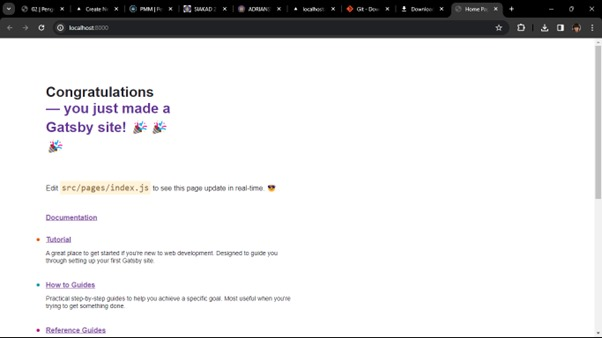

**1. Apa yang dimaksud dengan :**
    - TypeScript 
    - ESLint
    - Tailwind CSS
    - App Router
    - Import alias
    
    Jawaban:
    - TypeScript
        TypeScript adalah sebuah bahasa pemrograman open-source yang dikembangkan oleh Microsoft. Ini adalah superset dari JavaScript yang ditambahkan dengan fitur-fitur seperti static typing (pengetikan statis), yang membuatnya menjadi lebih kuat dan lebih mudah untuk melakukan refactoring dan debugging dalam pengembangan perangkat lunak. TypeScript dikompilasi menjadi JavaScript agar dapat dijalankan di berbagai lingkungan.

    - ESLint
        ESLint adalah alat (tool) linting untuk JavaScript yang digunakan untuk menganalisis kode JavaScript dalam pengembangan perangkat lunak. Tujuan utama ESLint adalah untuk menemukan dan secara otomatis memperbaiki pola kode yang tidak sesuai dengan pedoman (coding style) atau aturan (rules) tertentu yang telah ditentukan oleh tim pengembangan. Ini membantu memastikan kualitas kode yang lebih baik, konsistensi, dan mengurangi kemungkinan bug.

    - Tailwind CSS
        Tailwind CSS adalah sebuah framework CSS yang memungkinkan pengembang untuk membuat antarmuka pengguna (UI) dengan cepat menggunakan utility classes. Berbeda dengan beberapa framework CSS lainnya yang memiliki komponen-komponen yang sudah jadi, Tailwind CSS memberikan kustomisasi yang tinggi dengan memberikan sejumlah besar utility classes yang dapat diterapkan langsung pada elemen HTML. Ini memungkinkan pengembang untuk membangun desain web yang unik tanpa menulis CSS khusus.

    - App Router
         App Router mengacu pada bagian dari aplikasi (biasanya dalam konteks web atau pengembangan aplikasi seluler) yang bertanggung jawab untuk mengelola rute atau navigasi antara berbagai halaman atau komponen dalam aplikasi. Ini bisa berupa pustaka atau framework yang menyediakan fungsi untuk menangani perubahan URL dan memastikan bahwa aplikasi menampilkan halaman yang sesuai dengan URL yang diminta oleh pengguna.

    - Import alias
        Import alias adalah cara untuk memberikan nama alternatif atau alias untuk file atau direktori yang diimpor dalam kode JavaScript atau TypeScript. Ini memungkinkan pengembang untuk merujuk ke file atau direktori dengan nama yang lebih mudah dibaca atau singkat daripada path lengkapnya. Alias ini biasanya didefinisikan dalam konfigurasi proyek dan dapat digunakan untuk meningkatkan kejelasan dan keterbacaan kode.

**2. Berikut adalah penjelasan tentang setiap folder dan file yang biasanya ada dalam struktur proyek   Next.js (sebuah framework React.js):**
    - .git: Folder ini digunakan untuk menyimpan semua file dan riwayat perubahan dari versi kontrol Git. Ini termasuk riwayat commit, cabang, dan konfigurasi Git lainnya.

    - node_modules: Folder ini berisi semua paket dan dependensi dari proyek yang diinstal menggunakan npm atau Yarn. Ini termasuk paket-paket yang didefinisikan dalam file 'package.json'.

    - public: Folder ini digunakan untuk menyimpan asset-asset statis seperti gambar, ikon, atau file-file CSS yang tidak memerlukan pemrosesan khusus oleh Webpack atau Babel. Isi folder ini akan tersedia secara langsung di akar domain situs web Anda.

    - src: Folder ini biasanya berisi kode sumber aplikasi. Ini termasuk komponen React, halaman Next.js, logika bisnis, utilitas, dan file-file lain yang terkait dengan logika aplikasi.

    - .eslintrc.json: Berkas konfigurasi ESLint yang menentukan aturan dan konfigurasi linting untuk proyek. ESLint digunakan untuk menganalisis kode JavaScript dan menemukan potensi kesalahan atau pola yang tidak diinginkan.

    - .gitignore: Berkas ini digunakan untuk menentukan file dan folder yang seharusnya diabaikan oleh Git. Ini berguna untuk menghindari menyertakan file-file yang tidak perlu dalam repositori Git, seperti file konfigurasi lokal atau file build.

    - next.config.js: Berkas konfigurasi Next.js yang digunakan untuk menyesuaikan konfigurasi proyek, seperti mengatur pengaturan server, menambahkan plugin, atau menyesuaikan pengaturan Babel.

    - next-env.d.ts: Berkas ini secara khusus digunakan untuk mendukung TypeScript di dalam proyek Next.js. Ini berisi definisi tipe tambahan yang dibutuhkan oleh TypeScript agar dapat berfungsi dengan baik dalam proyek Next.js.

    - package.json : Berkas ini berisi metadata proyek, daftar dependensi, skrip yang dapat dieksekusi, dan konfigurasi proyek lainnya. Ini adalah bagian penting dari setiap proyek Node.js.

    - package-lock.json : Berkas ini dibuat oleh npm dan berisi informasi spesifik tentang versi dari setiap paket yang diinstal dalam proyek. Ini memastikan bahwa instalasi paket yang konsisten di berbagai lingkungan.

    - postcss.config.js : Berkas konfigurasi untuk PostCSS, yang digunakan untuk mengelola transformasi CSS, seperti prefixing vendor atau penggunaan sintaks yang lebih canggih seperti nesting.

    - README.md : Berkas markdown yang berisi dokumentasi atau informasi penting tentang proyek.

    - tailwind.config.ts : Berkas konfigurasi untuk Tailwind CSS, yang digunakan untuk menyesuaikan konfigurasi Tailwind dalam proyek.

    - ts.config.js : Berkas konfigurasi TypeScript untuk proyek Next.js, digunakan untuk menyesuaikan pengaturan kompilasi TypeScript dalam proyek.

**3. Penjelasan perubahan tanpa me-refresh halaman web site.**
    Pada proyek React yang menggunakan Next, perubahan kode dapat terlihat secara langsung tanpa perlu menjalankan kembali perintah "npm run dev" atau me-reload halaman di browser, berkat fitur Hot Module Replacement (HMR) yang disediakan oleh Next. HMR memungkinkan modul yang berubah diganti secara langsung pada saat runtime tanpa mengganggu keadaan aplikasi yang sedang berjalan, sehingga mempercepat siklus pengembangan dan membuat pengembangan lebih responsif dan efisien.

**4. Output**
    

Next.js adalah kerangka kerja React yang dirancang untuk mempermudah pengembangan aplikasi web, terutama aplikasi dengan tata letak halaman statis (SSG) dan peningkatan pada sisi klien (CSR). Fitur-fitur utama Next.js meliputi pre-rendering, routing dinamis, dan dukungan untuk API routing dan server-side rendering (SSR). Memiliki integrasi yang baik dengan React serta kemudahan penggunaan untuk membuat aplikasi dengan routing yang jelas dan struktur file yang terorganisir.

---

Remix adalah kerangka kerja baru untuk membangun aplikasi web modern yang memungkinkan pengembang menggunakan pendekatan "Fullstack JAMStack". Remix menawarkan kemampuan untuk mengintegrasikan logika bisnis di sisi server dan di sisi klien dengan mudah, serta memberikan fleksibilitas dalam menentukan bagaimana dan di mana komponen aplikasi di-render. Menawarkan fitur-fitur seperti praperendering, routing yang kuat, dan pengelolaan data yang baik.

---

Gatsby adalah kerangka kerja pembangunan situs web yang memanfaatkan React untuk membuat situs web yang cepat dan efisien. Dikenal dengan kemampuannya untuk membangun situs web statis yang dioptimalkan untuk kinerja. Gatsby menawarkan berbagai plugin dan tema yang memudahkan pengembang dalam menambahkan fitur-fitur dan fungsionalitas ke situs web mereka dengan cepat.

---

Perbedaan utama antara ketiganya adalah fokus dan pendekatan pengembangan yang berbeda. Next.js lebih berfokus pada aplikasi web dengan pre-rendering, Remix menawarkan pendekatan fullstack dengan integrasi logika di sisi server dan klien, sedangkan Gatsby lebih berfokus pada pembuatan situs web statis yang dioptimalkan untuk kinerja. Pemilihan kerangka kerja tergantung pada kebutuhan dan preferensi pengembang serta kompleksitas dari proyek yang akan dibangun.
